# Kakunin (確認)

**Verify that a "recruiter" really belongs to a Web3 project, using an ENSv2 team registry and signed attestations.** ETHGlobal Tokyo 2026.

> Testnet only (Sepolia). No mainnet funds are ever used.

**Live: <https://kakunin.xyz>** · **[create your own organisation](https://kakunin.xyz/create)** (about 2.5 minutes, no gas) · try [a lookalike](https://kakunin.xyz/check?who=alice_kakunn), [the real Alice](https://kakunin.xyz/check?who=100000001), the [scripted demo](https://kakunin.xyz/demo?run=all) and the [sample org dashboard](https://kakunin.xyz/org/kakunin-demo.eth). Telegram: [Mini App](https://t.me/KakuninxyzBot/app) · [@KakuninxyzBot](https://t.me/KakuninxyzBot). Also: [status](https://kakunin.xyz/status), [API docs](https://kakunin.xyz/docs).

## The problem

Impersonation is the #1 social-engineering vector in Web3. Scammers pose as recruiters or team members of real projects on Telegram, X and LinkedIn, then get victims to run malware or sign transactions. On 18 September 2026 Japan's National Police Agency and National Cybersecurity Office, the FBI and DC3, Australia's ACSC and Germany's BND and BfV published a joint advisory on **WaterPlum / "Contagious Interview"** (North Korea): at least 30,000 devices infected in more than 100 countries, over 7,000 cryptocurrency wallets drained of funds or credentials, and 1.7 billion JPY (10.71 million USD) transferred to the DPRK. The actors recruit job seekers through social media, job platforms and freelance marketplaces and have them run malicious files during a staged technical interview ([advisory, FBI IC3](https://www.ic3.gov/CSA/2026/260918.pdf); [NPA](https://www.npa.go.jp/bureau/cyber/pdf/20260918_e.pdf)).

Today the only defense is "be careful", and takedown tools chase an infinite list of fakes. **Kakunin certifies the real ones**: a finite, verifiable list that each project publishes on ENSv2.

## What it does

A check returns one of four answers:

| | Meaning |
|---|---|
| ✅ **Verified member** | Active subname in the org's team registry **and** a valid attestation signed by the org's own ENS name |
| 🕓 **Former member** | HR revoked the subname; the revocation date is derived from ENSv2 events |
| ⚠️ **Lookalike** | Handle / display name imitates a real member (NFKC, confusables, Levenshtein) |
| ❓ **Unknown** | The org publishes its team and this person is not in it |

Every failed check that claims an org raises an **impersonation alert** for that org (dashboard feed + Telegram).

Three sides:

- **Project (org):** owns `kakunin-demo.eth`; the team lives in its own registry `team.kakunin-demo.eth`. An **HR wallet** registers/revokes members through ENSv2 Enhanced Access Control **without controlling the root name**.
- **Member:** HR adds them, the app produces a one-time Telegram deep link, the member opens it from their own account; the bot captures the **numeric Telegram user ID** (never the mutable @username as identity) and the org attests it on ENS. No wallet needed for members.
- **Victim (free, public):** forward a suspicious message to the bot, or use the `/check` web page.

## Self-serve organisations: any project can join in about 2.5 minutes

Kakunin is not a single-org demo. [`/create`](https://kakunin.xyz/create) takes an ENS name and an owner wallet and, in about 2.5 minutes and 12 Sepolia transactions, builds the whole ENSv2 setup: `<name>.eth` registered **to the owner's wallet** (commit-reveal through the ETHRegistrar), an org `UserRegistry` and a team `UserRegistry` and two `PermissionedResolver`s through the `VerifiableFactory`, and a Kakunin **operator** key with least-privilege EAC roles that drops its setup rights on the org root at the end. Gas is sponsored on testnet.

- **The owner signs, the operator sends.** The dashboard signs in with the owner wallet (EIP-191, no gas); add / revoke / invite / Telegram-admin each need a fresh signature naming the exact target. The server then acts with the operator key.
- **Per-organisation everything**: directory, alerts, admins, invites. The bot and the Mini App serve all organisations: a check looks the person up everywhere, `/check acme.eth @user` checks one, and an organisation is alerted only when someone imitates one of its members or is one of its former members.
- **Telegram admin link** from the dashboard makes an account the recipient of alerts and unlocks the Mini App team console for that organisation.
- Provisioning is a resumable state machine (`packages/core/src/provision.ts`); `pnpm provision <label> <owner>` runs it from the CLI, and `scripts/e2e-http.ts` tests the full flow against a live deployment (create, add, onboard through Telegram initData, verify, alert, revoke).

## Public API, verifiable profiles and badges

- **API v1** (no key, CORS open, 60 req/min): [`/api/v1/check?telegramId=100000001`](https://kakunin.xyz/api/v1/check?telegramId=100000001) returns one of four verdicts plus, for verified members, a **proof** (registry, resolver, signed envelope, attester) that anyone can re-check without trusting Kakunin. [`/api/v1/org/kakunin-demo.eth`](https://kakunin.xyz/api/v1/org/kakunin-demo.eth) lists the published team (no Telegram IDs). OpenAPI 3.1: [`/api/v1/openapi.json`](https://kakunin.xyz/api/v1/openapi.json). Docs and a 10-line verification snippet: [kakunin.xyz/docs](https://kakunin.xyz/docs).
- **Profile pages** [`/v/alice`](https://kakunin.xyz/v/alice): what Kakunin can prove about a member, the attested numeric Telegram ID, and an explicit warning that a link alone does not prove who you are talking to (compare the ID).
- **Live badge** `` (SVG, refreshed every minute).
- **Brand**: the hanko seal (red seal, kanji 確) on a paper/ink/vermilion palette; sources in [`docs/brand/`](docs/brand/).

## Telegram Mini App

Kakunin also lives **inside Telegram**, where the attacks happen: open [@KakuninxyzBot](https://t.me/KakuninxyzBot), tap the **Kakunin** menu button (or send `/app`). A browser preview with sample data is at [kakunin.xyz/tg](https://kakunin.xyz/tg); direct link: [t.me/KakuninxyzBot/app](https://t.me/KakuninxyzBot/app).

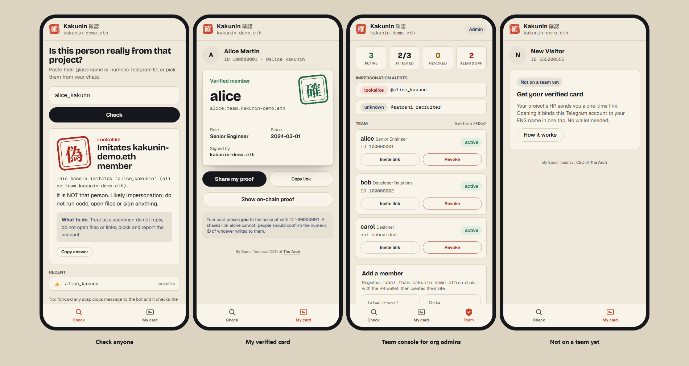

| Screen | What it does |
|---|---|
| **Check** | Paste a @username or numeric ID and get the four verdicts with proof; recent checks; **Pick a contact** hands over to the bot's native contact picker (`request_users`), which returns the real numeric ID even for people who hide forwards. |
| **My card** | The member's verified ID card (name, role, since, attested by), **Share my proof** through Telegram, and the on-chain proof. It states plainly that a link alone proves nothing about who is writing to you. Invitations are claimed here too (progress steps while the two on-chain writes happen). |
| **Team** (org admins only) | Live stats, impersonation alerts, the team from ENSv2, **Revoke** (native confirm dialog and haptics; signed by the HR wallet on the server, about 20 s on-chain), **Invite link** and **Add a member** (registers on-chain, then shares a one-time link through Telegram). |

Why a Mini App changes the security model: Telegram signs `initData` with a key derived from the bot token, and the server verifies that signature on **every** request ([`packages/core/src/telegram.ts`](packages/core/src/telegram.ts), 7 tests including a forged user ID). So the account opening the app is authenticated: "My card" cannot be requested for someone else, the ID that gets attested at onboarding is the one Telegram signed, and admin actions are limited to the accounts that ran `/subscribe`. API routes: [`apps/web/src/app/api/tg/`](apps/web/src/app/api/tg/); UI: [`apps/web/src/components/tg/TgApp.tsx`](apps/web/src/components/tg/TgApp.tsx).

## Screenshots

Live against the Sepolia deployment at [kakunin.xyz](https://kakunin.xyz) (light theme shown; the UI follows the system theme, has a manual toggle, and is mobile-friendly).

| Home: try it in one second | Verifiable profile |
|---|---|
| 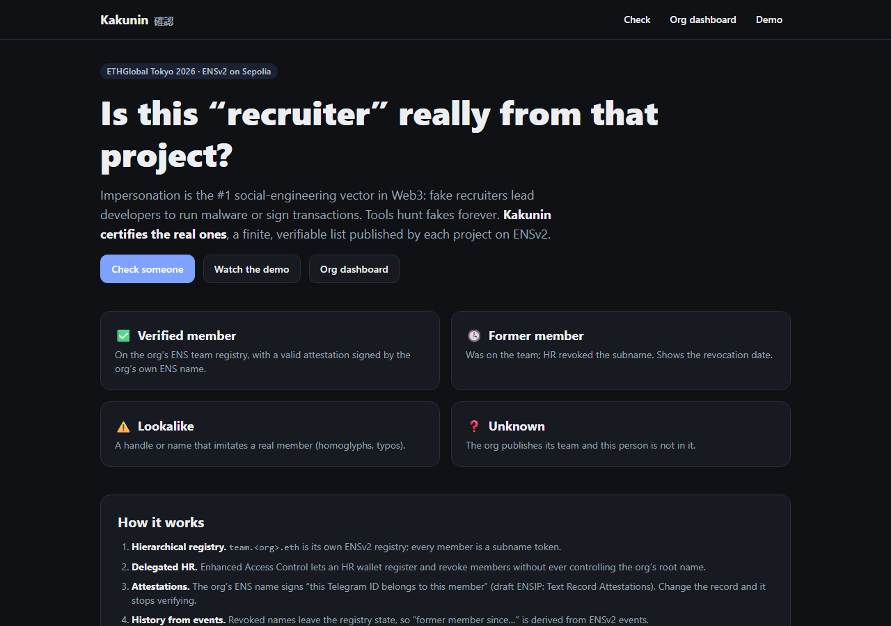 | 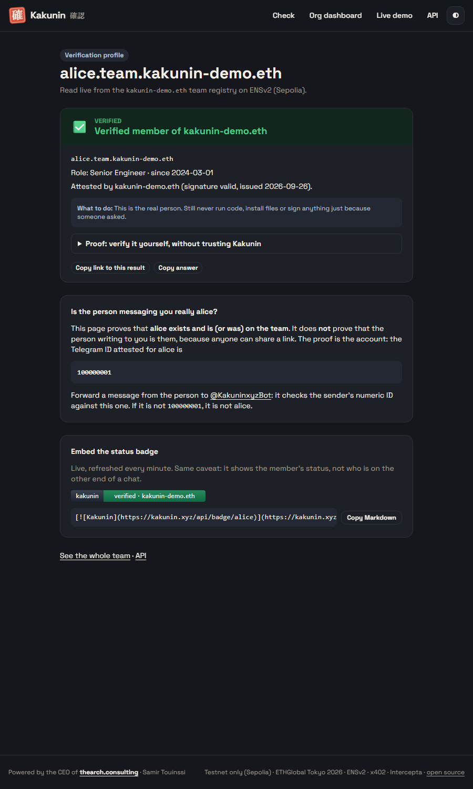 |

| Live demo: four real checks + alerts | Org dashboard: team, EAC delegation, alerts |
|---|---|
| 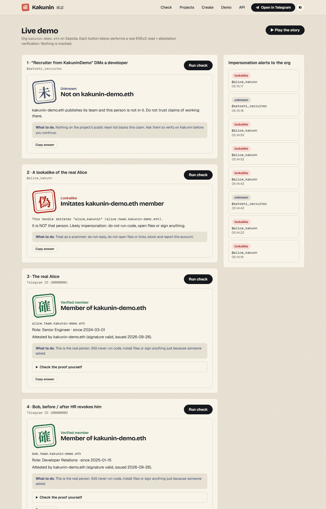 | 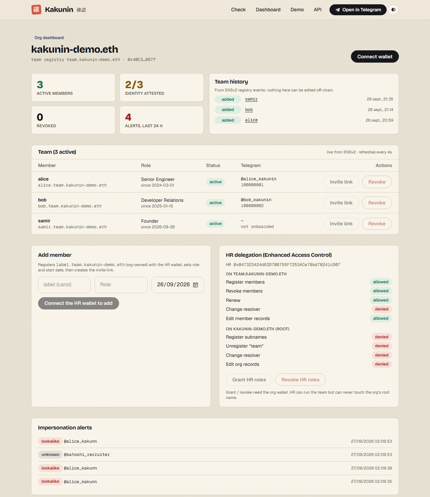 |

| Lookalike caught | Verified, with proof |
|---|---|
| 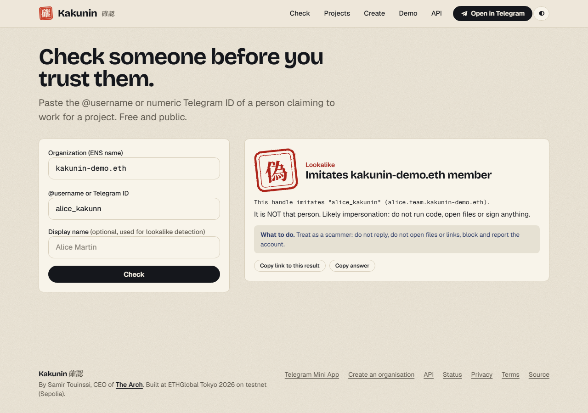 | 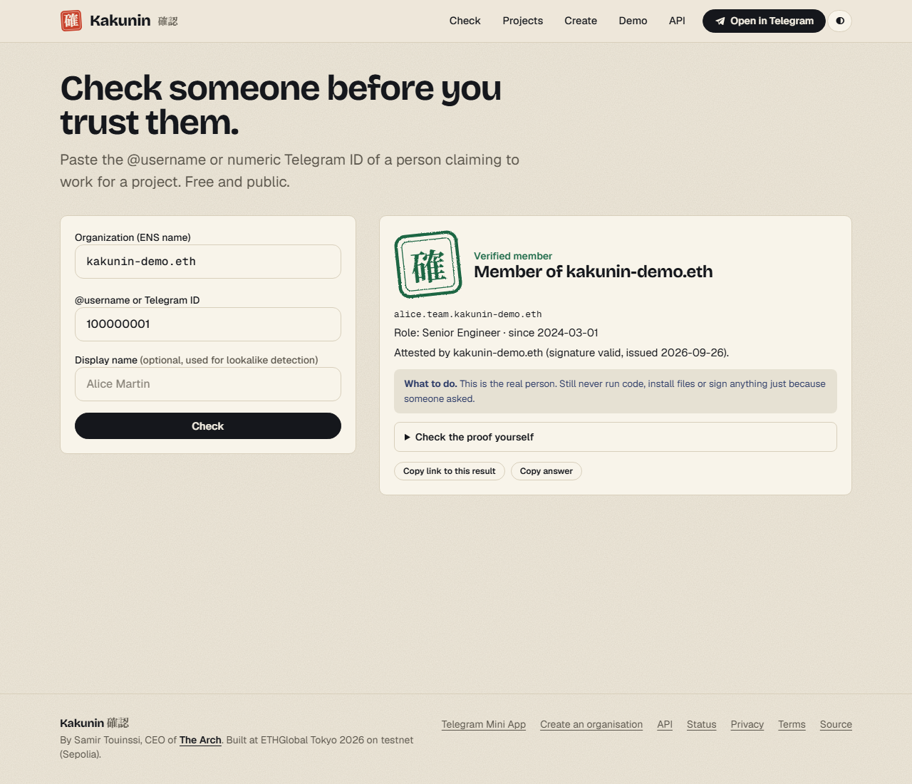 |

| Create your organisation (self-serve) | API docs |
|---|---|
| 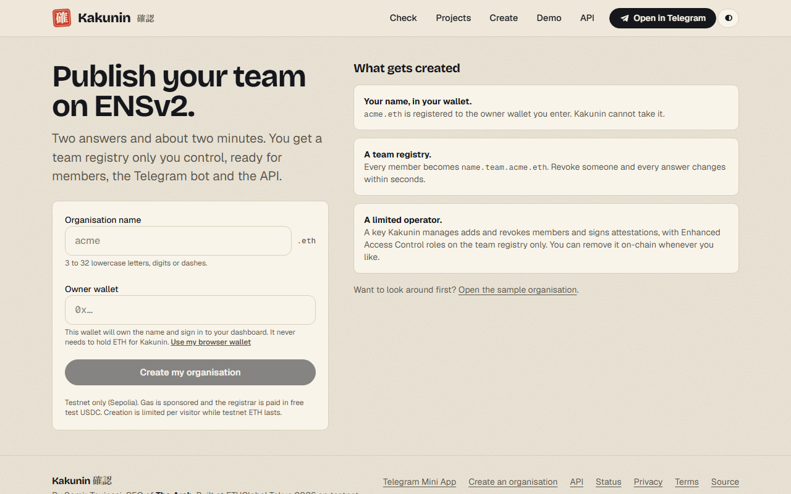 | 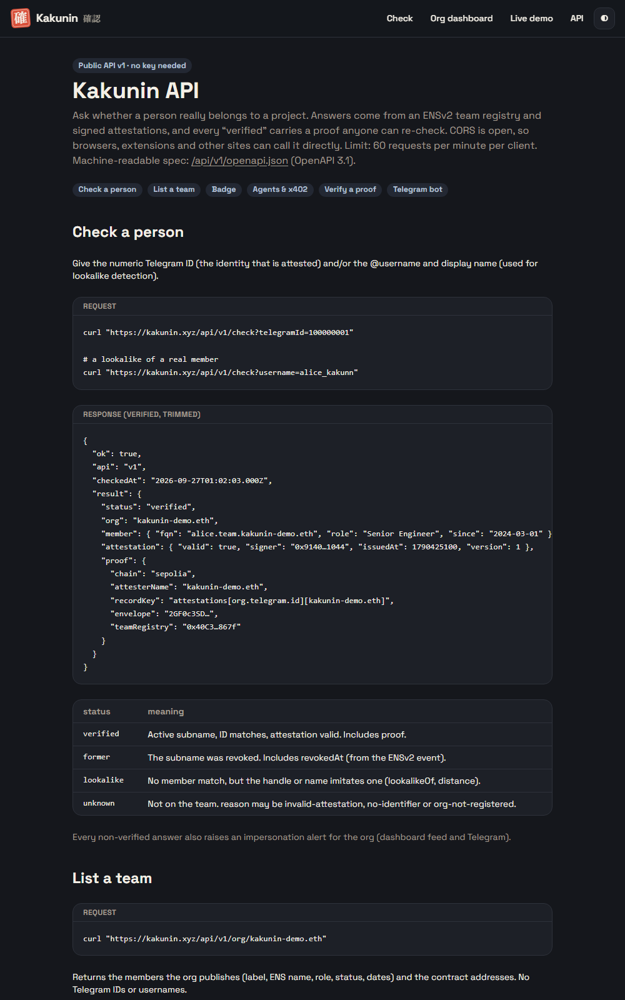 |

## How ENSv2 is used (central, not cosmetic)

| ENSv2 feature | Role in Kakunin | Code |
|---|---|---|
| **Hierarchical registries** (`UserRegistry` proxies via `VerifiableFactory`) | `kakunin-demo.eth` → `team.kakunin-demo.eth` → `alice.team.kakunin-demo.eth`; each level is its own registry | [`scripts/spike-ens.ts`](scripts/spike-ens.ts), [`packages/core/src/ens.ts`](packages/core/src/ens.ts) |
| **Enhanced Access Control** | HR gets `REGISTRAR｜UNREGISTER｜RENEW` on the **team registry root only** and `SET_TEXT` on the **team resolver only**. On-chain checks show HR cannot unregister `team`, change resolvers, or edit org records | [`/api/delegation`](apps/web/src/app/api/delegation/route.ts), dashboard panel |
| **Permissioned Resolver** (per-account, per-record roles) | A separate resolver for the team so HR's write permission never touches the org's own records | [`ens.ts`](packages/core/src/ens.ts) |
| **Universal Resolver V2** | All reads (`text`, `addr`) go through it, the way any ENSv2 client resolves | [`readText` / `readAddress`](packages/core/src/ens.ts) |
| **Registry events** (`LabelRegistered` / `LabelUnregistered`) | An unregistered name disappears from state, so "former member since …" comes from events and block timestamps | [`listMembers`](packages/core/src/ens.ts) |
| **Text records + draft ENSIP "Text Record Attestations"** ([PR #85](https://github.com/ensdomains/ensips/pull/85)) | The org's ENS name is the attester. Attestation lives at `attestations[org.telegram.id][kakunin-demo.eth]`; if the record, the owner or the attester key changes, it stops verifying | [`attestation.ts`](packages/core/src/attestation.ts) |

Attestation format: DAG-CBOR payload `{n,a,k,v,t}`, EIP-191 over `keccak256(payload)`, envelope `Tag(0x61747374)[version, t, sig]`. Our tests reproduce **byte for byte a real mainnet attestation** validated by the atst.me reference verifier (`jkm.eth`, attested by `atst.lighthousegov.eth`). We issue the draft-PR layout (v1) and verify both it and the deployed playground layout (v2). Details and the discrepancy we found are in [`specs/DECISIONS.md`](specs/DECISIONS.md).

### Deployed on Sepolia

See [`deployments/sepolia.json`](deployments/sepolia.json): `kakunin-demo.eth`, org registry, team registry, two resolvers (ENSv2 contract addresses are in `specs/DECISIONS.md`).

## Paid check for AI agents: x402 + Intercepta screening

Kakunin's check is also sold per call over **x402** (0.001 USDC, Base Sepolia). The buying agent **screens the destination with the live Intercepta API before it signs**, and the verdict decides what happens: pay, refuse, or ask a human.

| What | File |
|---|---|
| **Live Intercepta call** (`GET api.web3antivirus.io/api/public/v2/extension/account/{address}/quick-scan`, `x-api-key`) | [`apps/paid-api/src/screener.ts`](apps/paid-api/src/screener.ts) |
| **Live Intercepta token call** (`GET …/extension/token-intelligence/token/{address}/risks?chainId=…`, "Scan Token"): a second opinion on the payment token where the API covers the network (mainnets). Base Sepolia, where our demo pays, is not covered, so there the allowlist alone decides; try `pnpm --filter @kakunin/paid-api probe token` | [`apps/paid-api/src/screener.ts`](apps/paid-api/src/screener.ts) (`rawTokenScan`, `tokenVerdictFromResponse`) |
| Hook that screens `payTo` **before signing** (x402 `onBeforePaymentCreation`) and aborts on a bad verdict | [`apps/paid-api/src/agent.ts`](apps/paid-api/src/agent.ts) |
| Decision policy: refuse lookalike tokens, spending limits, refuse high-risk `payTo`, ask a human on medium/unknown, **fail closed** if screening errors | [`packages/core/src/screening.ts`](packages/core/src/screening.ts) |
| Paid API (seller) and a FAKE clone whose `payTo` is a flagged address | [`apps/paid-api/src/server.ts`](apps/paid-api/src/server.ts) |

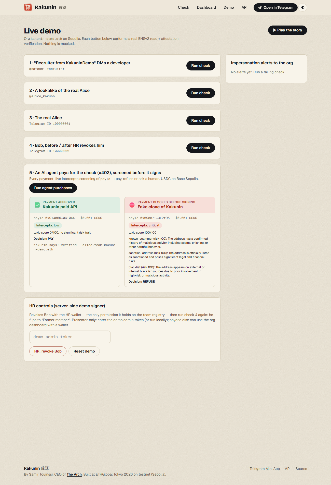

Real run on 2026-09-26 (`pnpm paid` then `pnpm agent`, or the **Run agent purchases** button on `/demo`):

```
=== http://localhost:4021/check?telegramId=100000001          (real Kakunin API)
  verdict  low, toxic score 0/100, no significant risk trait
  decision PAY, payTo 0x9140…1044 screened low; $0.001 within limits
  outcome  PAID  -> {"status":"verified","member":{"fqn":"alice.team.kakunin-demo.eth", ...}}
=== http://localhost:4022/check?telegramId=100000001          (fake clone)
  verdict  critical, toxic score 100/100; known_scammer; sanction_address; blacklist
  decision REFUSE
  outcome  BLOCKED, payment never signed
```

On-chain check afterwards: the agent went from 20 to 19.999 USDC and the org address received 0.001 USDC on Base Sepolia; nothing was sent to the clone. The payment runs on a testnet while the screened addresses are real mainnet addresses, as the prize asks.

**Feedback on the Intercepta API (5 lines)**
- Time to first call: about 2 minutes once the key arrived (the key itself arrives by email after the request, so it is not instant during a 36h event).
- Confusing: the API reference (`docs.web3antivirus.io`) sits behind a bot challenge, so scripts and AI tools get a 403; we found the host and path through a public search and confirmed them by calling. The response shape (`toxicScore` + `traits[]`) and its thresholds are not documented where we could read them, so the pay/refuse cut-offs in our policy are our own choice.
- Missing: quick-scan answers `404 "An Externally Owned Account with this address doesn't exist"` for contract addresses (e.g. Circle's USDC contract); many payees are contract wallets, so a contract-aware answer (or a clear "unsupported") would help agents.
- Nice: per-trait reasons (`sanction_address`, `known_scammer`, `blacklist`) are directly displayable to a person, and latency was about 1 second.
- Wish: a documented list of test addresses per risk class in the docs, not only in the chat channel.

## Curvegrid: Best AI Agent Project

**One sentence:** Kakunin's buying agent is a policy-aware transaction agent for agent-to-agent payments: before it signs an x402 payment it checks the token, the amount and the counterparty against a written policy and a live risk API, and it pays, refuses or asks a human, failing closed whenever it is unsure.

| Policy rule (what the agent does before signing) | Where |
|---|---|
| Refuse a **lookalike token**: only the canonical USDC contract per network is accepted, whatever the server advertises (allowlist), plus Intercepta Scan Token on covered mainnets | [`POLICY.trustedAssets`](apps/paid-api/src/agent.ts#L16-L24), [`decidePayment`](packages/core/src/screening.ts#L67) |
| **Spending limits**: hard stop at $0.05, a human must approve above $0.01 | [`POLICY`](apps/paid-api/src/agent.ts#L16-L24) |
| **Screen the counterparty** with the live Intercepta API (no mock) and refuse high or critical risk, ask a human on medium or unknown | [`screener.ts`](apps/paid-api/src/screener.ts), [`decidePayment`](packages/core/src/screening.ts#L67) |
| **Fail closed**: a screening error never pays automatically; an unattended agent treats "ask a human" as a refusal | [`agent.ts#L47-L61`](apps/paid-api/src/agent.ts#L47-L61) |
| Runs **before** the payment is created, through the x402 SDK hook | [`onBeforePaymentCreation`](apps/paid-api/src/agent.ts#L47) |

The agent is also a **product surface**: the same engine backs `/demo` (button **Run agent purchases**), and the check it buys is Kakunin's own. **MultiBaas was not used** in this project, so there is no MultiBaas feedback to give; the prize is judged on idea and execution.

How to run and test it: see [Run it](#run-it) below (`pnpm test` covers the policy in [`screening.test.ts`](packages/core/test/screening.test.ts) and the Intercepta mapping in [`screener.test.ts`](apps/paid-api/test/screener.test.ts); `pnpm paid` then `pnpm agent` runs the two purchases).

## Architecture

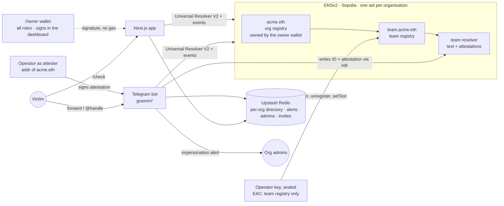

## Repo layout

```
packages/core   ENS helpers (viem), attestations, lookalike detection, check engine, multi-org store, provisioning state machine, wallet-signature auth, org resolver
apps/bot        Telegram bot (grammY), serves every organisation
apps/web        Next.js app: /create, /orgs, /org/<name> dashboard (wallet signature), /check, /demo, /docs, /tg Mini App, /status, API
apps/paid-api   x402 seller, fake clone, agent screened by Intercepta
scripts         provision (create an org from the CLI), e2e-http and create-org-http (live end-to-end), cloud-check, seed-demo, spike-ens (idempotent, --dry-run) ...
deployments     Sepolia addresses
specs           SPEC, DECISIONS (every decision and spike result, dated), PROMPTS
```

## Run it

Requirements: Node 22, pnpm.

```bash
pnpm install
cp .env.example .env            # then: pnpm spike:wallets  (generates throwaway testnet keys into .env)
# fund the printed ORG and HR addresses with Sepolia ETH (faucet)
pnpm test                       # 133 tests (core 105, bot 15, paid-api 13)
pnpm provision acme 0xOwner…    # create a self-serve organisation from the CLI (same engine as /create)
pnpm rehearse                   # replays the whole demo against the live chain, with assertions
pnpm --filter @kakunin/scripts seed      # idempotent: attester address, members, attestations (add --dry-run to preview)
pnpm --filter @kakunin/web build && pnpm --filter @kakunin/web start   # http://localhost:3000
pnpm --filter @kakunin/bot dev           # needs TELEGRAM_BOT_TOKEN (BotFather) in .env
```

**Test the agent** (needs `INTERCEPTA_API_KEY` from https://intercepta.io/ethglobal and `AGENT_PRIVATE_KEY` funded with Base Sepolia USDC from https://faucet.circle.com):

```bash
pnpm paid     # x402 seller on :4021 and a FAKE clone on :4022
pnpm agent    # two purchases, each screened before signing: one paid, one blocked, with the reason printed
pnpm cloud:check https://kakunin.xyz --agent   # the same against the live deployment (spends 0.002 testnet USDC)
```

The 4-minute demo script and Q&A cheat sheet are in [`docs/DEMO.md`](docs/DEMO.md). Every on-chain script announces network, contract, function and arguments **before** sending. `KAKUNIN_DEMO_SIGNER=1` (localhost only) lets `/demo` revoke and reset with the throwaway keys.

## Hosted demo (Vercel): everything runs in the cloud

The whole system deploys as one Vercel project (root directory `apps/web`): web app, **Telegram bot as a webhook**, the **x402 paid API and its fake clone**, the agent demo and a persistent **Upstash Redis** store. Step-by-step setup, variables and a one-command verification (`pnpm cloud:check`) are in [`docs/CLOUD.md`](docs/CLOUD.md). The presenter-only buttons (HR revoke / reset) need a demo admin token; the agent demo is open to everyone but rate limited.

## Status

- ✅ ENSv2 registry + EAC delegation + attestations + check engine: **verified live on Sepolia**
- ✅ **Self-serve organisations**: created through the public API and the /create wizard on kakunin.xyz (137, 141 and 155 s in three measured runs); the full flow (create, add, Telegram onboarding, verify, alert, revoke) is tested live by `scripts/e2e-http.ts`
- ✅ Web app (`/create`, `/orgs`, `/org/<name>`, `/check`, `/demo`, `/docs`, `/status`), deployed on Vercel with Upstash
- ✅ Telegram bot (webhook) and Mini App: unit-tested, and exercised through signed initData on the live API; not yet screen-tested by the builder in the Telegram client
- ✅ x402 paid check + agent screened by the live Intercepta API (one payment approved, one blocked): tested on Base Sepolia
- ✅ Policy-aware x402 buyer agent (Curvegrid track): see the section above. MultiBaas is not used
- ⏳ Mainnet: ENSv2 is beta on Sepolia; the design is chain-agnostic

## Security

A security review with live attack tests is in [`docs/SECURITY.md`](docs/SECURITY.md) (findings, fixes, accepted limitations). Secrets are scanned across the whole git history; dependency audit is clean.

## AI attribution

This project is built by the team **with** AI assistance, as allowed by the event rules. Specs and prompts are in the repo ([`specs/`](specs/)).

- **Claude Code (Anthropic, Claude Sonnet 5)** wrote most of the code, tests and docs in this repository under the builder's direction: `packages/core`, `apps/bot`, `apps/web`, `scripts`, the specs and this README. Each commit carries a `Co-Authored-By: Claude` trailer.
- **Human contribution (the builder):** product concept and scope, all sponsor/prize strategy decisions, the decision to drop MTProto in favour of an own-registry username lookup, the EAC delegation design choices (org owns subnames; HR limited to the team registry), wallet funding and testnet operations, review and go/no-go on every on-chain action.
- ENSv2 contract facts were taken from docs.ens.domains and verified ABIs (Blockscout), not guessed; see `specs/DECISIONS.md`.

## Team

**Samir Touinssi**, CEO of [The Arch](https://thearch.consulting). Solo builder.

- X: <https://x.com/SamirTouin>
- LinkedIn: <https://www.linkedin.com/in/tsamir/>
- Telegram: [@SamirTouin](https://t.me/SamirTouin)
- GitHub: <https://github.com/SamirStream>
- All links: <https://linktr.ee/SamirTouin>

## License

MIT
